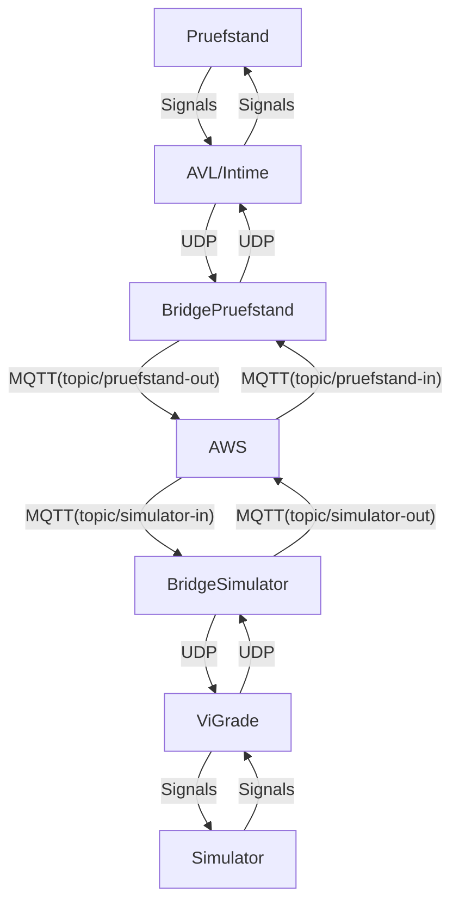

# Project: UDP-2-MQTT Bridge

## Overview

This repository contains a bidirectional UDP to MQTT bridge. It seamlessly translates data between UDP packets and MQTT messages, enabling interoperability between UDP and MQTT-based systems.

### Send Signals from Pruefstand to Simulator AWESOME



AVL-->Intime;
Intime-->BridgePruefstand;
BridgePruefstand-->AWS;
AWS-->BridgeSimulator;
BridgeSimulator-->Simulator;
Simulator-->BridgeSimulator;
BridgeSimulator-->AWS;
AWS-->BridgePruefstand;
BridgePruefstand-->Intime;
Intime-->AVL;
AVL-->Pruefstand;

## Creating an IoT Thing and Downloading Certificates Using AWS CLI

### Step 1: Create an IoT Thing

1. Create a new IoT thing:

   ```sh
   aws iot create-thing --thing-name your-thing-name
   ```

   Replace `your-thing-name` with the desired name for your IoT thing.

### Step 2: Get the AWS IoT Endpoint

1. Retrieve the AWS IoT endpoint:

   ```sh
   aws iot describe-endpoint --endpoint-type iot:Data-ATS
   ```

   This command will return the endpoint URL that your IoT device will use to communicate with AWS IoT.

### Step 3: Create and Download Certificates

1. Create a new certificate and keys:

   ```sh
   aws iot create-keys-and-certificate --set-as-active --certificate-pem-outfile cert.pem --public-key-outfile public.key --private-key-outfile private.key
   ```

   This command will generate a certificate and keys, and save them to `cert.pem`, `public.key`, and `private.key` respectively.

2. Attach the certificate to your IoT thing:

   ```sh
   aws iot attach-thing-principal --thing-name your-thing-name --principal arn:aws:iot:region:account-id:cert/certificate-id
   ```

   Replace `your-thing-name` with the name of your IoT thing, and `arn:aws:iot:region:account-id:cert/certificate-id` with the ARN of the certificate created in the previous step.

### Step 4: Attach a Policy to the Certificate

1. Create an IoT policy (if you don't have one already):

   ```sh
   aws iot create-policy --policy-name your-policy-name --policy-document file://policy.json
   ```

   Replace `your-policy-name` with the desired name for your policy, and ensure `policy.json` contains the appropriate policy document.

2. Attach the policy to the certificate:

   ```sh
   aws iot attach-policy --policy-name your-policy-name --target arn:aws:iot:region:account-id:cert/certificate-id
   ```

   Replace `your-policy-name` with the name of your policy, and `arn:aws:iot:region:account-id:cert/certificate-id` with the ARN of the certificate.

### Step 5: Download the Root CA Certificate

1. Download the Amazon Root CA certificate:

   ```sh
   wget https://www.amazontrust.com/repository/AmazonRootCA1.pem
   ```

### Step 6: Copy all the Certificates

1. Copy all the certificates and keys to the `config/certs` directory in the project root.

2. Rename the certificates and keys as follows or change configuration in `config.yaml`:

   - `cert.pem` -> `certificate.pem.crt`
   - `public.key` -> `public.pem.key`
   - `private.key` -> `private.pem.key`
   - `AmazonRootCA1.pem` -> `root.pem`

3. Update the `config.yaml` file with the appropriate certificate and key filenames.

### Send UDP data to the bridge

```sh
echo "{\"specversion\":\"1.0\",\"id\":\"$(uuidgen)\",\"source\":\"https://bosch-engineering.com\",\"type\":\"com.bosch-engineering.ping\",\"datacontenttype\":\"application/json\",\"data\":{\"message\":\"ping\"}}" | socat - UDP-DATAGRAM:127.0.0.1:6000
```

### Receive UDP data from the bridge

```sh
while true; do nc -u -l 6001; echo ""; done
```
